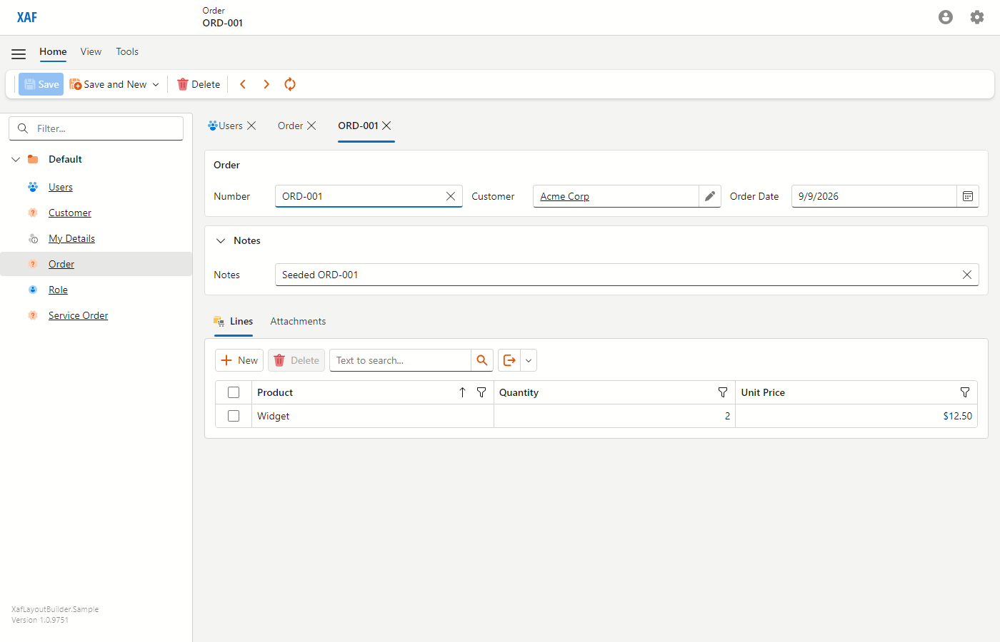
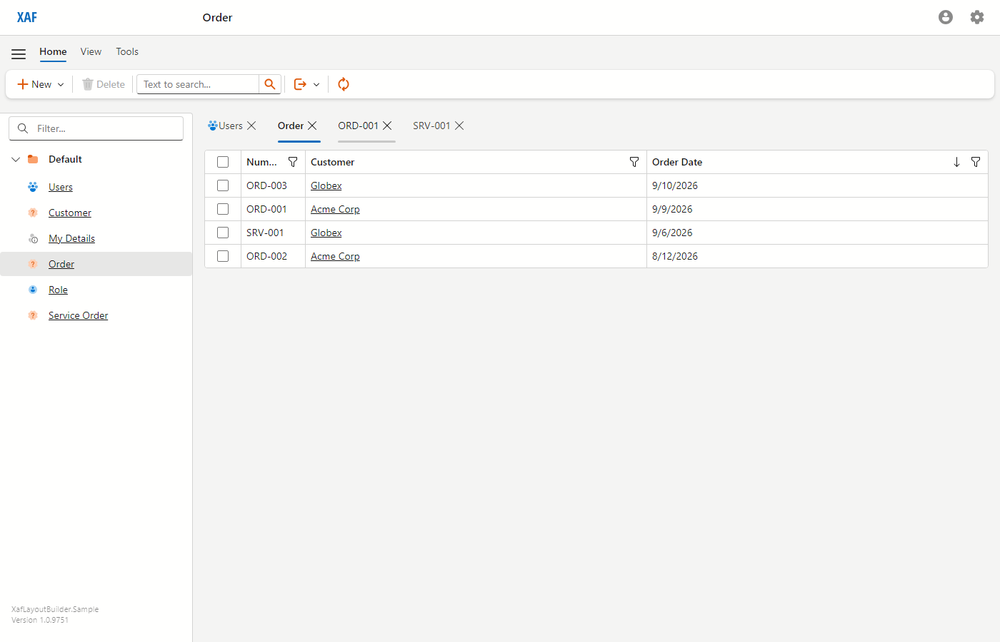
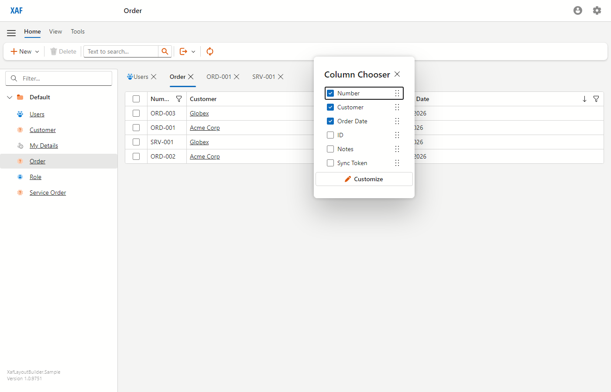
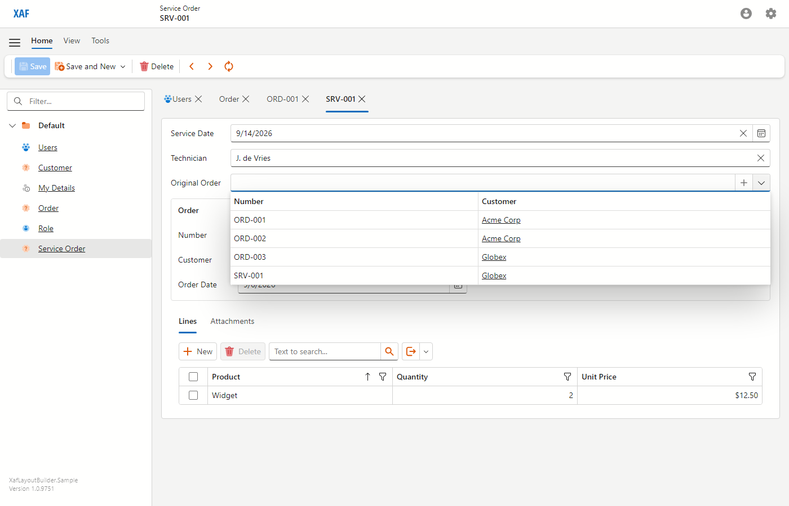
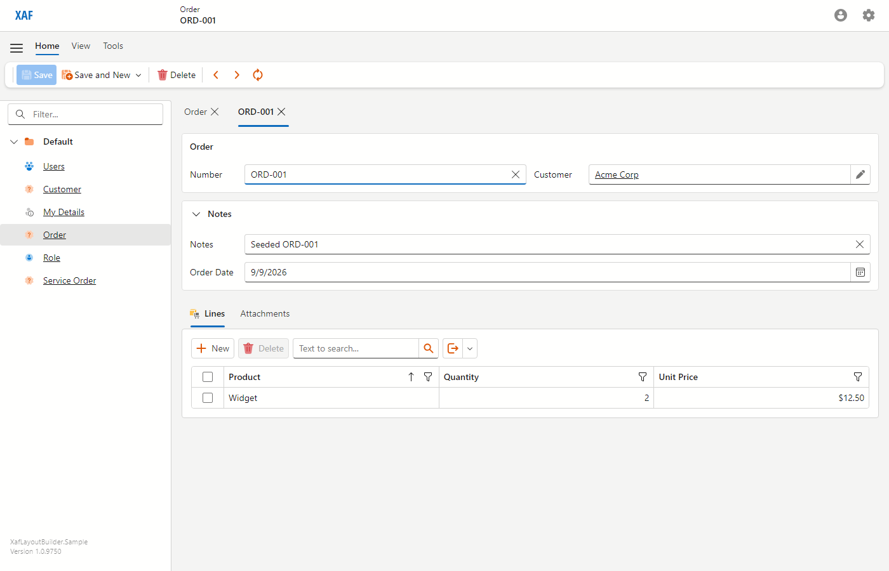
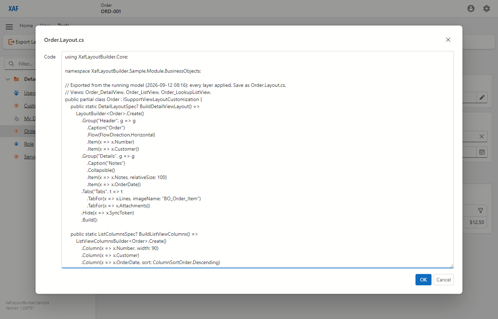
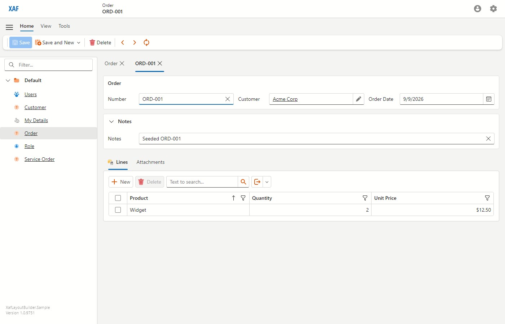
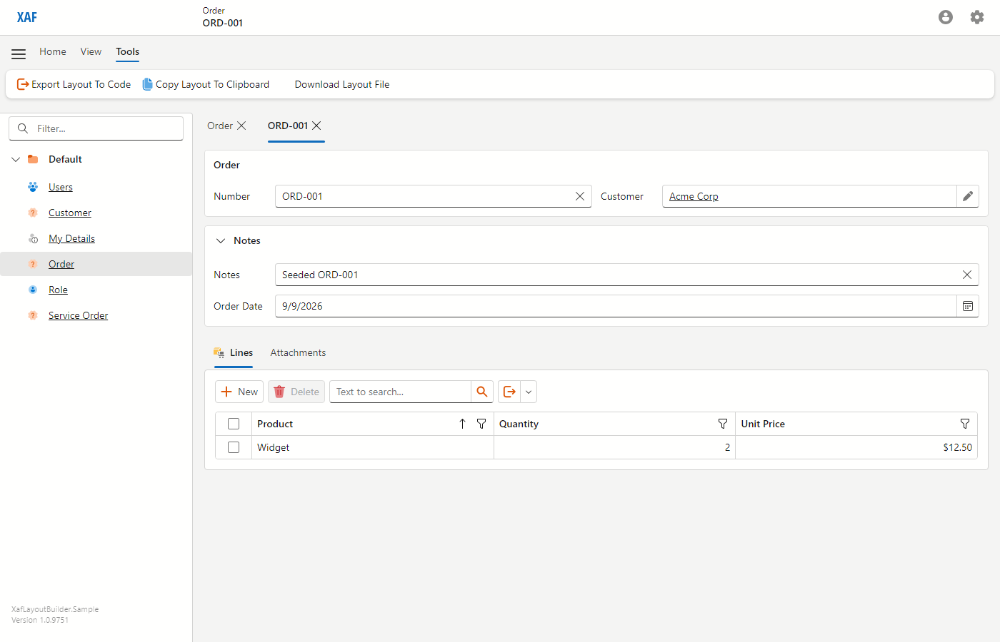
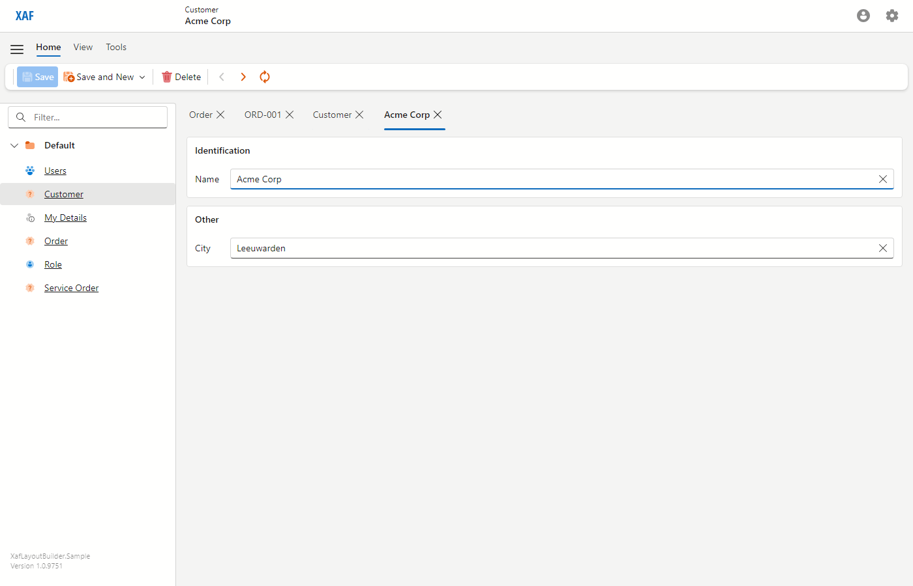

# XafLayoutBuilder

Typed, compile-checked C# for DevExpress XAF view layouts, poured into the Application Model as
generated-layer defaults. The running Blazor app stays the visual designer. The source of truth
becomes a fluent builder next to the business class instead of `Model.xafml`.

**Status: proof of concept, complete against its start document** (`XafLayoutBuilder-START.md`).
Built and tested with DevExpress XAF 26.1.4, .NET 10, EF Core 10, SQL Server LocalDB and Blazor
Server. One subject (the sample `Order`), one end-to-end gate, and the limitations listed below.

> **Inspired by [DevExpress Support Center ticket T1206756](https://supportcenter.devexpress.com/ticket/details/T1206756)**,
> on using the Model Editor and developing XAF outside Windows.

## What it looks like

```csharp
public partial class Order : ISupportViewLayoutCustomization
{
    public static DetailLayoutSpec? BuildDetailViewLayout() =>
        LayoutBuilder<Order>.Create()
            .Group("Header", g => g
                .Caption("Order")
                .Flow(FlowDirection.Horizontal)
                .Item(x => x.Number)
                .Item(x => x.Customer)
                .Item(x => x.OrderDate))
            .Group("Details", g => g
                .Collapsible()
                .Item(x => x.Notes, relativeSize: 100))
            .Tabs("Tabs", t => t
                .TabFor(x => x.Lines, imageName: "BO_Order_Item")
                .TabFor(x => x.Attachments))
            .Hide(x => x.SyncToken)
            .Build();

    public static ListColumnsSpec? BuildListViewColumns() =>
        ListViewColumnsBuilder<Order>.Create()
            .Column(x => x.Number, width: 90)
            .Column(x => x.Customer)
            .Column(x => x.OrderDate, sort: ColumnSortOrder.Descending)
            .Hide(x => x.SyncToken)
            .Lookup(l => l
                .Column(x => x.Number)
                .Column(x => x.Customer))
            .Build();
}
```

That file is the sample's only layout source for `Order`; the sample module has no XAFML for it.

## What you get

- **Compile-checked members.** Renaming a property breaks the build, not the running app.
- **Ordinary XAF layering.** The builder output is the generated layer, so module XAFML,
  administrators and users can still customise on top, and their changes win. That is precedence,
  not survival: a stored difference targets a node path such as `Main/SimpleEditors/Name`, and the
  builder replaces the generated tree with its own group paths, so converting a view that already
  carries customisations does not carry them over. A frozen layout (`FreezeLayout`) is a
  self-contained copy and does. Check `ModelDifference` and module XAFML for a view before you
  convert it.
- **Startup diagnostics.** A broken layout is reported at startup with a numbered diagnostic that
  names the view and the member. The host decides what that does: with `FailFastOnLayoutErrors` on
  (development, CI) the application stops; off, the default, it is logged and the view keeps XAF's
  own layout, so one layout typo never takes a production host down.
- **The app is the designer.** "Export Layout To Code" prints any type's current layout, every
  layer applied, back as the same C#. Arrange it in the running app, paste the code, commit. With
  the Blazor add-on referenced, "Copy Layout To Clipboard" puts it on the clipboard and "Download
  Layout File" saves it as `{Type}.Layout.cs`, both in one click.
- **A skill for agents.** [`skills/xaf-layout-builder/SKILL.md`](skills/xaf-layout-builder/SKILL.md)
  documents the whole API surface for Claude Code, so an agent writes C# instead of XAFML.

## Screenshots

From the E2E gate's run on the sample.

| | |
|---|---|
|  |  |
| DetailView from the builder: captioned Header, collapsible Details, tabs, SyncToken hidden. | ListView: builder column order, sorted by Order Date descending. |
|  |  |
| The hidden Sync Token column stays available in the column chooser. | The lookup shows only the columns from `.Lookup(...)`. |
|  |  |
| A user difference moved Order Date into Details and wins over the builder. | The export prints that merged layout as builder C#. |
|  |  |
| With the user's differences deleted, the builder layout is back. | The Blazor add-on adds copy and download next to the export. |
|  | |
| Opting out of the strict rule: whatever the layout does not mention lands in one group. | |

## Run it

Requirements: .NET 10 SDK, a DevExpress 26.1 NuGet feed (licensed), SQL Server LocalDB. The E2E
gate also needs Playwright's Chromium.

```bash
dotnet build XafLayoutBuilder.slnx
dotnet test XafLayoutBuilder.Tests
dotnet run --project XafLayoutBuilder.E2ETests
```

The gate builds the sample, starts it on port 5100, asserts, stops it, and exits 0 (pass),
1 (fail) or 2 (Chromium missing). For exit 2, install the browser once:

```powershell
pwsh XafLayoutBuilder.E2ETests/bin/Debug/net10.0/playwright.ps1 install chromium
```

To look around yourself, run `dotnet run --project XafLayoutBuilder.Sample.Blazor.Server`, open
http://localhost:5000 and log in as `Admin` with an empty password. The sample creates the LocalDB
catalog `XafLayoutBuilder.Sample` and its users on first start in Debug builds.

## Packages

`XafLayoutBuilder.Core`, `XafLayoutBuilder.Module` and `XafLayoutBuilder.Blazor` are published as
NuGet packages to a local folder feed; nothing is on nuget.org.

```bash
dotnet pack XafLayoutBuilder.slnx -c Release -o artifacts/packages
dotnet nuget push "artifacts/packages/*.nupkg" --source C:\Projects\local-nuget
```

Register the feed once per machine: `dotnet nuget add source C:\Projects\local-nuget --name local-nuget`
(a Windows path with backslashes; NuGet rejects `C:/Projects/local-nuget` as an invalid source).
A folder feed does not accept the same version twice, so bump `PackageVersion` in
`Directory.Build.props` before every push. The packages need DevExpress 26.1.4 or a later 26.1
patch and refuse 26.2; the version the repository builds against is `DevExpressVersion` in the same
file.

## Use it in your own solution

1. Reference the `XafLayoutBuilder.Module` package, which brings `XafLayoutBuilder.Core`, from the
   local feed (see [Packages](#packages)), or reference the projects. Never copy the sources in as a
   folder inside one of your existing module projects. `ModuleBase` scans its own assembly for database updaters and model difference
   resources, so a module copied into yours would run your updaters a second time (XAF does not
   remove duplicates, so seeders run twice) and read your model resources as its own.
2. Require the module from yours:
   `RequiredModuleTypes.Add(typeof(XafLayoutBuilder.Module.XafLayoutBuilderModule));`
   In a Blazor host, add `XafLayoutBuilder.Blazor` too if you want the clipboard and download actions.
3. Add a partial `{Type}.Layout.cs` implementing `ISupportViewLayoutCustomization`, or call
   `LayoutRegistry.Register<T>(detail, columns)` for types you do not own. Registration checks
   nothing: every rule is applied when the view is built, under `FailFastOnLayoutErrors`. Pass
   factories (`Register<T>(() => ..., () => ...)`) when building the spec could throw.
4. Optionally set `XafLayoutBuilderModule.EnableExport` from your configuration, so administrators
   see the export action without a debugger attached. Never from an environment variable.
5. Set `XafLayoutBuilderModule.FailFastOnLayoutErrors` from your configuration: on in development
   and CI, so a broken layout stops the application at startup; off, the default, in production,
   where it is written to XAF's `eXpressAppFramework.log` and the view keeps XAF's own layout.

The full surface, the rules and the checklist for changing a class are in the skill.

## Startup diagnostics

| Code | Meaning |
|---|---|
| XLB001 | A placed member has no view item, because it is `[Browsable(false)]` or hidden with `[HideInUI]`. `[VisibleInDetailView(false)]` keeps the view item, so such a member can still be placed. |
| XLB002 | A visible member is neither placed nor hidden in the DetailView layout. |
| XLB003 | A column names a collection, or something that is not a member of the type. |
| XLB004 | A type has a spec but no default view to apply it to. |

## How it works

Two generator updaters apply the specs when XAF builds the generated model layer, one for DetailView
layouts and one for ListView columns. A startup check forces XAF to generate every view that has a
spec, so layout errors surface before the first user. The exporter walks the merged model back into
specs, and a printer turns specs into the builder C#.
[docs/how-it-works.md](docs/how-it-works.md) explains the design and where XAF pushed back.
[docs/api-notes.md](docs/api-notes.md) holds the verified XAF API facts with source references.

## Limitations

**Out of scope by design** (start document section 2):

- Localised captions. A separate repository.
- ListView bands. Not investigated beyond the model node's existence.
- WinForms. The module is platform neutral, but nothing was run on WinForms.
- Composing a derived class's layout from its base. A derived class keeps XAF's default layout
  unless it declares its own.
- Runtime editing. No chat, MCP or AI at runtime; the repository gives agents a target.
- Reconciling the builder with module XAFML for the same view. Module XAFML simply applies on top.

**Scope limits of this proof of concept:**

- Only the default views are handled: `{Type}_DetailView`, `{Type}_ListView` and
  `{Type}_LookupListView`. View variants, nested ListViews and custom views are left to XAF.
- Member lambdas must be simple member access. `x => x.Customer.Name` is rejected.
- Builder changes appear after a restart. With XAF's model cache enabled, the cache must be
  invalidated as well; the sample does not enable it.
- Administrator and user differences override the builder, by design. A user who customised a
  property keeps seeing their value after the builder changes, until their differences are reset.
- Every visible member must be placed or hidden in a DetailView layout, so adding a property to a
  class with a layout means touching the layout. That strictness is the default on purpose; a class
  can opt out with `.Unplaced(UnplacedMembers.AppendToGroup("Other"))`, which collects whatever the
  layout does not mention into one group at the end of the form.

**The export:**

- Copying and downloading are separate actions, not buttons inside the popup. XAF Blazor renders
  only its own OK and Cancel in a popup for a non-persistent object, so both sit next to the export
  in the Tools tab, in the optional `XafLayoutBuilder.Blazor` project. Without that project
  referenced, the popup is still select-all and copy.
- The download needs one small JavaScript module, shipped inside the add-on. A server-side action
  cannot start a browser download on its own, and Chrome blocks top-level `data:` navigation, so an
  anchor has to be created and clicked. That file is the only JavaScript in the repository.
- Exported ListViews list every unshown column as `.Hide(...)`, except the key. The model does not
  record whether a column was hidden or never mentioned, so the export is more verbose than
  hand-written code. One difference is not cosmetic: a hidden column that still carried a sort
  order loses it, because the applier clears the sort of every column the spec does not list.
- Columns and layout items bound to a nested path, such as `Customer.Name`, cannot be expressed by
  the builder. They are skipped and named in the leading comment instead of printed.
- A class that opted into `.Unplaced(...)` exports that call again rather than the members the
  catch-all happened to hold, so adopting the exported file does not quietly restore the strict
  rule. A catch-all group holding anything other than plain editors is reported in the comment.
- Sort priority follows column order in the export.
- A group caption XAF derived earlier can survive a user's change and is then exported as an
  explicit caption. In the sample, Details keeps the caption "Notes" after Order Date moves in.
- The view you invoke the action from is the one exported. The other half of the class comes from
  the type's default views, and the printed comment names the three view ids it read.
- The action is for administrators, and only with a debugger attached or `EnableExport` set. A host
  with no security system has no roles to ask, so there every user sees it.

**Engineering caveats:**

- The column updater writes XAF's internal `GeneratedIndex` value by name, so that administrators'
  frozen column sets keep working. A rename in a future DevExpress release would show up as a wrong
  column order in E2E 2. The frozen-columns behaviour itself is reasoned from source, not tested.
- The updaters' checks (XLB001, XLB002, the structural rules) and the spec resolver are unit tested;
  the model changes themselves and the exporter need a live Application Model and are tested only
  through the E2E gate. The start document asked for an exporter unit test; the round trip is
  asserted in the gate instead (E2E 5a).
- E2E 4 writes the user-layer XAFML that XAF's layout editor would persist, rather than driving the
  editor's drag and drop, and restarts the host around the write because XAF Blazor saves the user
  model through a deferred dispatcher.
- The startup check runs once per process for a given application type and set of registered layouts, not once per
  Blazor circuit. Registering a layout at runtime makes the next application validate again.
- Only the combination above was tested. The sample seeds `Admin` and `User` with empty passwords
  in Debug builds; it is a demonstration, not a production template.

## Repository layout

```
XafLayoutBuilder.Core/                  builder, LayoutSpec records, JSON, C# printer (no DevExpress reference)
XafLayoutBuilder.Module/                generator updaters, registry, startup check, exporter, export action
XafLayoutBuilder.Blazor/                optional Blazor add-on: Copy Layout To Clipboard, Download Layout File
XafLayoutBuilder.Sample.Module/         Customer, Order (+ lines, attachments), ServiceOrder : Order
XafLayoutBuilder.Sample.Blazor.Server/  XAF Blazor host from the DevExpress 26.1 template
XafLayoutBuilder.Tests/                 xUnit tests for Core and the Module's resolver and registry
XafLayoutBuilder.E2ETests/              C# Playwright console app, the gate
skills/xaf-layout-builder/SKILL.md      the Claude Code skill
docs/                                   how-it-works, api-notes, cases (from generated apps), screenshots
```

## Related repositories

- **XafMergerTool** stays the answer for stock XAF, where XAFML is the only source form. It can gain
  an "export as builder C#" option by referencing `XafLayoutBuilder.Core`.
- A code generator can emit `LayoutSpec` for generated applications, as C# through the printer or
  later as JSON (`LayoutSpecJson` already round-trips).
- **xafskills** receives a copy of the skill on release.

## License

MIT, see [LICENSE](LICENSE). DevExpress XAF is not included here and is licensed separately:
building or running the sample needs your own DevExpress subscription.
